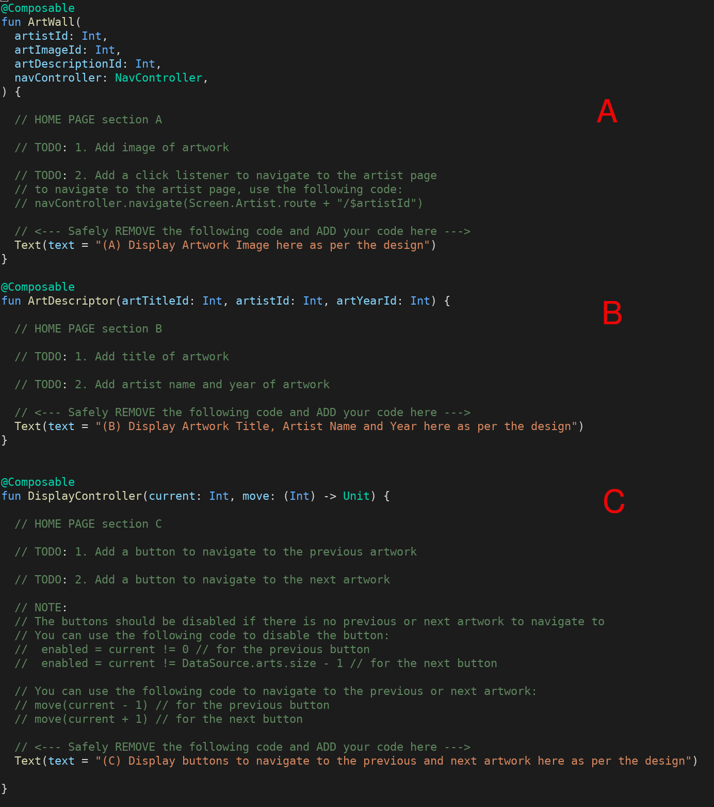
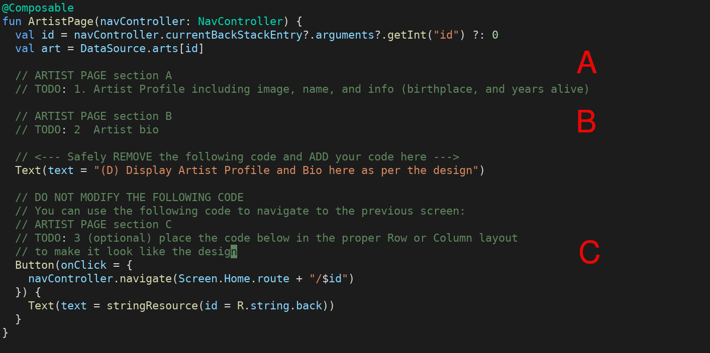
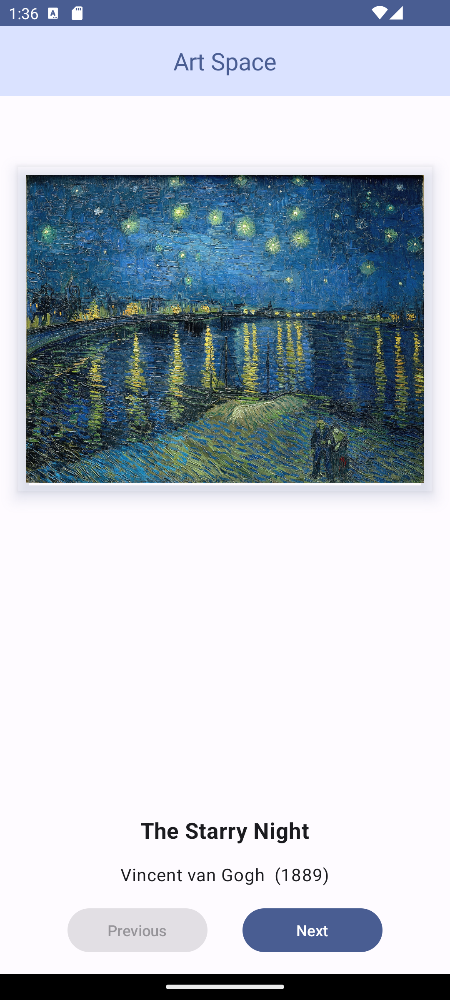
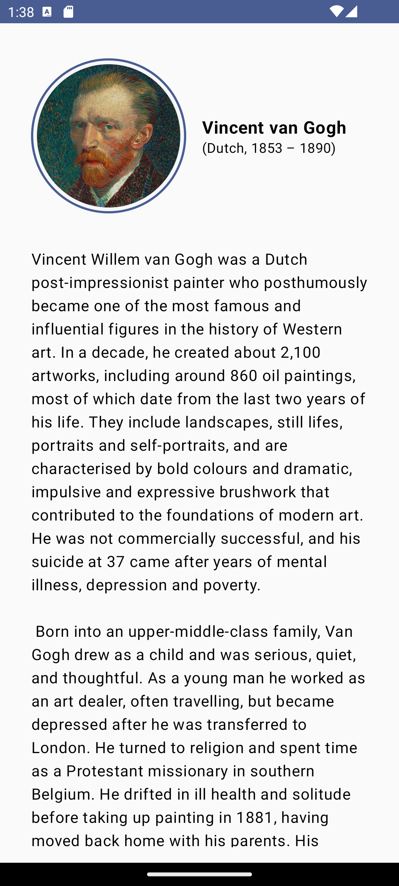
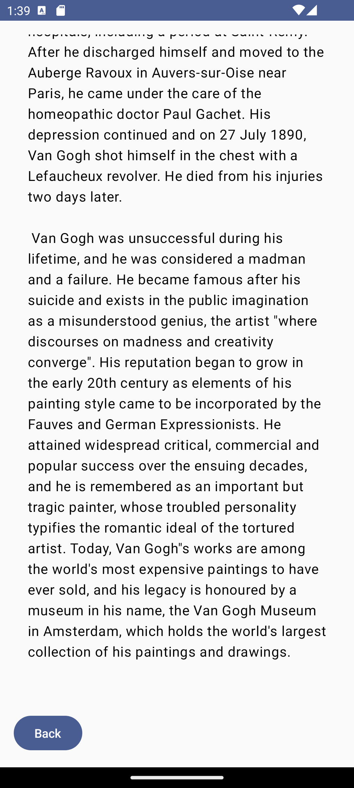
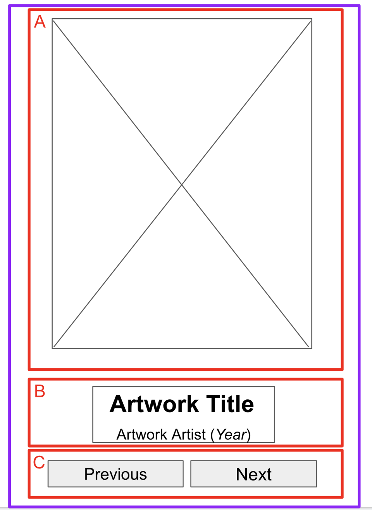
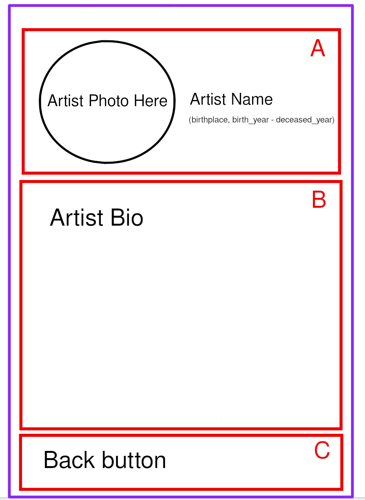

<!-- used to created pdf file -->
<!-- $ pandoc README.md -V geometry:a4paper,margin=2cm -o project1.pdf --lua-filter ~/Temp/linebreaks.lua -->
<!-- --- -->
<!-- author: Hendrix Tavarez -->
<!-- fontfamily: helvet -->
<!-- geometry: margin=2cm -->
<!-- linkcolor: PineGreen -->
<!-- header-includes: -->
<!-- \hypersetup{ -->
<!--     colorlinks=true, -->
<!--     urlcolor=PineGreen, -->
<!--     citecolor=PineGreen, -->
<!-- } -->
<!-- \usepackage{fancyhdr} -->
<!-- \usepackage{caption} -->
<!-- \captionsetup[figure]{ -->
<!--     name=, -->
<!--     labelsep=none, -->
<!--     labelformat=empty -->
<!-- } -->
<!-- \pagestyle{empty} -->
<!-- \pagestyle{fancy} -->
<!-- --- -->
<!---->
# Project 1: Art Space


## To be completed 

Read the project description, layout details and complete all "TODO" sections using the information below.

To download the code to complete your assignment, you can use these git commands:

```
$ git clone https://github.com/hendrix-lehman/cmp431.git
$ cd cmp431/AssignmentProjects/ArtSpace
```

Alternatively you can download the repository as a zip file, unzip it, and open it in Android Studio.

[Download Here](https://github.com/hendrix-lehman/cmp431/archive/refs/heads/main.zip)

[Download Instructions](./assets/download_instructions.pdf)

After unzipping the project zip file, please find the project directory here:

```
$ cd cmp431-main/AssignmentProjects/ArtSpace 
```

The code snippet below are located in the MainActivity.kt file.


| Home Page Code     | Artist Page Code       |
|-----------------|--------------------|
|  |  |


## Description

The Art Space application showcase a curated collection of artwork from the [Artvee](https://artvee.com/) website.

Users of this application can navigate through the collection by selecting "Next" or "Previous" from the Home Page.

To get more information about a particular artist, users can touch/click the artwork to navigate to the Artist Page. 

To navigate back to the collection, users can select the "Back" button. 

| Home Page       |       Artist Page  (top)      |      Artist Page (bottom) |
|-----------------|-------------------------------|------------------------|
|  |  |  |

## Layout

### Home Page

The Home Page is broken down into smaller sections as follow:

- Section A is the Arwork Wall. It just display the artwork image.
- Section B is the Arwork description. It displays the artwork title, artist name and year created.
- Section C is the artwork collection navigation. Previous goes back to the previous artwork and Next to the following artwork

### Artist Page

The Artist Page is broken down into smaller sections as follow:

- Section A is the Artist Profile. It displays the artist photo, name, birthplace and both birth and deceased year.
- Section B is the Artist short biography. It display a bit of history about the artist.
- Section C is the Back button. It allows users of this application to return to browse the artwork collection.

| Home Page       | Artist Page        |
|-----------------|--------------------|
|  |  |


